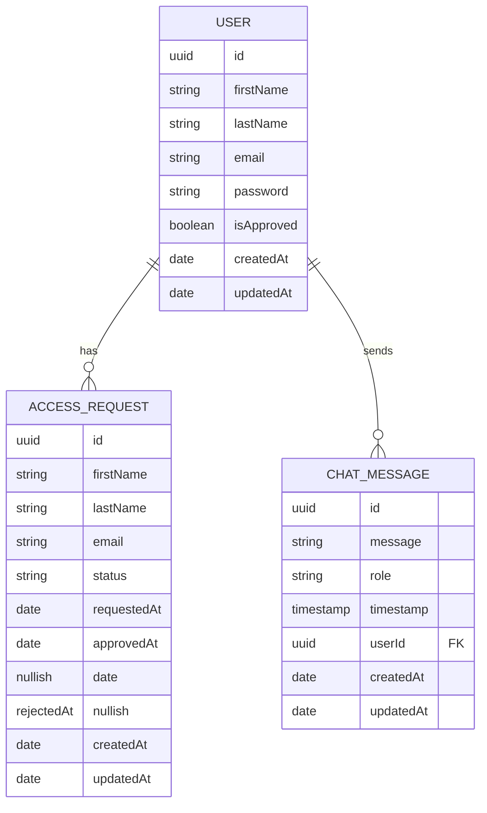

# Tripmate AI - Travel & Food Recommendation System

Tripmate AI is a platform that enables users to ask for personalized recommendations on travel destinations, food, and local experiences, powered by ChatGPT and real-time data from the TripAdvisor API. The system is designed to provide users with seamless interaction while managing user access and chat requests, ensuring a smooth experience.

## Key Features

- **AI-Powered Chat for Recommendations**: Users can interact with the system to get tailored recommendations for travel and dining using ChatGPT, which queries the TripAdvisor API.
- **Access Control**: After the first 10 users, access becomes restricted. New users must request access, which triggers an approval workflow that includes email notifications.
- **Chat History Management**: Users can view their past conversations and responses in a single thread. They cannot initiate new chat threads until future iterations of the platform.
- **Rate Limiting**: Users are limited to 20 chat messages per day. This ensures that system resources are not abused.
- **Langchain Integration**: The platform leverages Langchain and Langgraph to create a ReAct agent that uses tool-calling to dynamically fetch and refine recommendations from TripAdvisor, enhancing response accuracy and relevance.

## Architecture Overview

The project employs hexagonal architecture and clean design principles to create a scalable and responsive platform.

### Frontend

- **Next.js** and **TypeScript** are used to build the user interface, allowing users to log in, chat with the AI, and view their chat history.
- **Shadcn UI** provides a customizable and scalable design system to enhance user experience.

### Backend

- **NestJS** is the core of the backend, responsible for handling user authentication, chat interactions, and API requests.
- **PostgreSQL** stores user data, chat history, and access control information, ensuring structured data management and persistence.

### AI Engine

- **LangChain** and **LangGraph** are used to construct a ReAct agent, allowing the AI to interact with the TripAdvisor API.
- The agent calls the TripAdvisor API in real-time to fetch travel and food recommendations, providing responses based on dynamic data.

### Deployment & CI/CD

- The project is containerized using **Fly.io** for hosting, ensuring portability and scalability.
- **GitHub Actions** are used for CI/CD, automating deployment workflows and tests for smooth updates.

## Entity Relationships

The platform’s data model revolves around user accounts, chat messages, access requests, and chat limits. Below is the entity relationship diagram (ERD) represented in **Mermaid**:

### Explanation:

- **User**: This table stores user information, including credentials like email and password. It also holds an approval status (`is_approved`) to indicate whether a user has access to the platform beyond the initial 10 users, as well as timestamps for when the account was created or last updated.
- **Access Request**: This table tracks user requests for access when the limit of initial users has been reached. It includes the user ID, request status, and timestamps for when the request was made (`requested_at`) and approved (`approved_at`). The `approved_at` field is marked `nullish()` as it will be empty until access is granted.

- **Chat**: This table records chat interactions between users and the AI. Each entry stores the user ID, the message they sent, and the AI's response.
