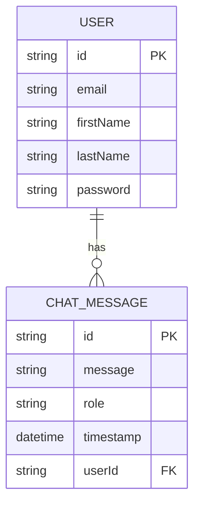

# TripMate AI

TripMate AI is an intelligent travel companion application that helps users plan and enhance their travel experiences using AI-powered recommendations and insights.

## Features

- AI-powered chat interface for travel recommendations
- User authentication and authorization
- Integration with TripAdvisor API for up-to-date travel information
- Personalized travel suggestions based on user preferences
- Daily chat limit to manage resource usage

## Tech Stack

- Backend: NestJS (TypeScript)
- Database: PostgreSQL
- ORM: TypeORM
- AI: OpenAI GPT-4, LangChain
- Authentication: JWT

## Getting Started

### Prerequisites

- Node.js (v14 or later)
- PostgreSQL
- OpenAI API key
- TripAdvisor API key

### Installation

1. Clone the repository:

   ```
   git clone git@github.com:tobycodes/tripmate-ai.git
   cd tripmate-ai
   ```

2. Install dependencies:

   ```
   npm install
   ```

3. Set up environment variables:
   Copy the `.env.example` file to `.env` and fill in the required values.

4. Start the development server:
   ```
   npm run start:dev
   ```

## How It Works

### AI-Powered Chat Interface

The chat interface allows users to interact with the AI to get travel recommendations. The AI is powered by OpenAI's GPT-4 model and is integrated using LangChain. Users can ask for travel suggestions, and the AI will provide personalized recommendations based on the user's input.

### User Authentication and Authorization

The application uses JWT for authentication and authorization. Users can register, log in, and access their personalized travel recommendations. The authentication endpoints are secured, ensuring that only authorized users can access their data.

### Integration with TripAdvisor API

TripMate AI integrates with the TripAdvisor API to fetch up-to-date travel information. This includes details about popular destinations, restaurants, hotels, and more. The AI uses this information to provide accurate and relevant recommendations to users.

### Daily Chat Limit

To manage resource usage, the application enforces a daily chat limit. Each user can initiate up to 20 chat sessions per day. This limit helps in controlling the usage of the AI resources and ensures fair usage for all users.

## Entity Relationship Diagram


